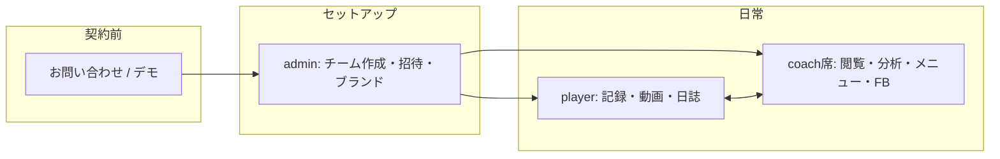
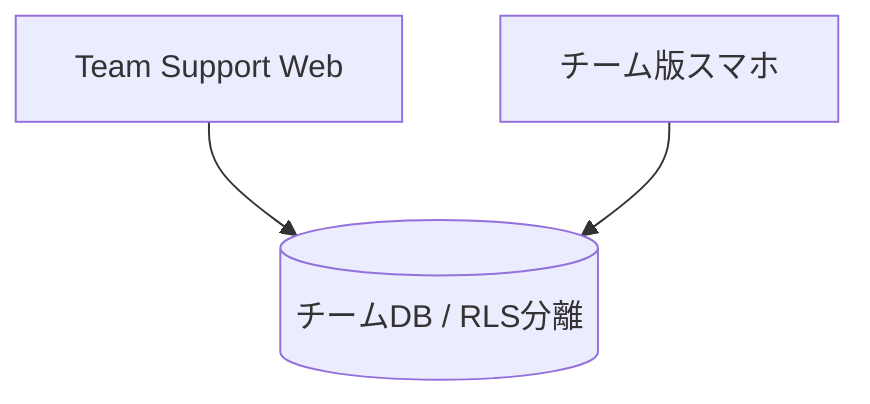

# PlusStation Team Support — サービス分析＆HP用整理

作成: 2026-08-20  
事実ソース: ユーザー共有プロンプト（コード／現行Webベース）  
関連: `product-model-personal.md` / `hp-copy-draft.md` / `hp-redesign-blueprint.md` / `hp-brief.md`  
状態: **分析完了・実装前。相談用の正**

推論には「仮説」と明示。金額・未確認事項は断定しない。

---

## A. サービス理解サマリー

### What（何を）
**PlusStation Team Support**（通称イメージ: Plus Station Team）は、スポーツチーム向けの **B2B SaaS**。  
選手の体調・練習負荷・自主トレ動画・指導者とのやりとりを、**チーム専用の安全な環境**でまとめて回す。

提供形態:
- Web（Next.js）… 管理・分析・運営寄り
- チーム版スマホ（Expo / `plusstation-new` の team-tabs）… 記録・日誌・現場入力寄り  
→ **同じチームDB**を参照。個人向けアプリとは **Auth・課金・ポリシー・DBを分離**。

### For whom（誰に）
- **Buyer（買う人）**: クラブ運営者、強化部長、ヘッドコーチ、アカデミー責任者、チームオーナー  
- **User（使う人）**: 指導者・トレーナー・アナリスト・選手  

### Why now（なぜ今・仮説）
部活・クラブで「紙・LINE・感覚」のコンディション管理が限界になりやすい一方、大手は重い／高額／現場に合わないことがある。**仮説**: ユース〜クラブ規模で「記録＋負荷の目安＋自主トレ＋日誌」を一体で回したい需要がある。

### How it works（契約→招待→日常）
1. 契約前: お問い合わせ／デモ  
2. 契約後: 運営（admin）がチームを用意し、**招待制**で指導者・選手が参加  
3. 日常: 選手が体調・振り返り等を入力 ↔ 指導者が閲覧・分析・メニュー・日誌／フィードバック  
4. データはチーム単位で分離（RLS）。他チームから見えない  

### 個人版との違い

| | 個人版 ++Station | チーム版 Team Support |
|--|--|--|
| 顧客 | 個人（B2C） | チーム・団体（B2B） |
| 課金 | ストア IAP（無料＋Premier等） | チーム契約（公開価格表なし） |
| DB / ログイン | 個人用（分離） | チーム用（分離） |
| 主目的 | 自分の自主トレ・記録・Score | 組織の見える化・指導運用 |
| HP導線 | ストア | 問い合わせ／デモ（ログインは契約済み向けに分離） |

### 競合カテゴリ上の位置（一文）
日誌だけでも、動画見放題だけでもない。**「チームでコンディションと負荷の目安を見ながら、自主トレと指導コミュニケーションまで同じ箱で回す」** ためのチームオペレーション基盤。

---

## B. サービスモデル図

### 収益の流れ（文章）
チーム（Buyer）と契約 → 利用料・導入／サポート範囲に応じた対価（詳細は要確認）→ 招待された指導者・選手が利用。  
公開セルフサーブ課金は主戦場ではない。個人の Premier 誘導はしない。

### 利用の流れ（mermaid）

### データ分離・席モデルの価値
- **RLSによるチーム完全分離**: 他団体のデータが混ざらない安心感（Trustの核）  
- **指導者席（coach seats）**: 複数コーチログインを1つの“席”にまとめ、選手から見える窓口・日誌・Pushを席単位で扱う → **現場の「誰宛の日誌か」問題への差別化（実装済み価値）**

### Web × アプリの役割分担（事実＋運用仮説）

| | Web | チーム版アプリ |
|--|--|--|
| 向く作業 | 横断分析、メニュー運用、管理、CSV等 | 朝の入力、振り返り、日誌、通知、現場 |
| 仮説 | 指導者・運営はPCブラウザが多い | 選手はスマホが主 |

---

## C. サービス内容マップ

| 価値カテゴリ | 課題（現場） | 機能（事実） | 現場ベネフィット | HP用一言 |
|--------------|--------------|--------------|------------------|----------|
| 記録・コンディション | 紙・LINEで散らばる | 朝の体調、練習後振り返り、フィジカル、身体情報、BMR等 | 毎日の状態が同じ場所に残る | 朝と練習後の記録を、チームの共通フォーマットに |
| 分析 | 感覚だけで負荷判断 | 体調推移・Z、要注意、sRPE、ACWR、TSB、Monotony、Strain、種目別負荷、移動平均、チーム平均、選手比較等 | 「誰が要注意か」の目安が持てる | 感覚だけに頼らない、負荷と体調の目安 |
| 自主トレ | メニューが伝わらない／続かない | 動画ライブラリ、プレイリスト、タイマー連動、オリジナル／チームメニュー割当 | 遠征・自宅でも同じ意図のトレができる | 指導の意図を、動画とメニューで選手の手元へ |
| コミュニケーション | 誰に何を返したか不明 | フィードバック／練習日誌（席モデル）、お知らせ、Push | 窓口が席単位で整理される | 指導者席ごとに、やりとりの窓口を明確に |
| 運営 | オンボーディングが雑多 | 招待制、チーム切替、ブランド、スケジュール、怪我、CSV、Googleカレンダー連携等 | 契約チームとして閉じた運用ができる | 招待制で始まり、チームの色で運用できる |
| セキュリティ | 他チームとデータが混ざる不安 | RLS分離、運営プロビジョンのクローズド運用 | 安心して本番データを預けられる | チームのデータを、チームの境界で守る |

※ACWR / TSB 等は HP 本文では「負荷のバランスの目安」等に言い換え、専門ページや注釈で補足してよい。

---

## D. ターゲット整理

### ペルソナ（仮説込み・断定しすぎない）

**1. Buyer — アカデミー／クラブ責任者**  
- Jobs: 怪我リスクとコンディションを組織として見える化し、保護者・上部への説明責任を果たしたい  
- 決め手: データ分離、運用の閉じ方、指導者複数でも回ること、導入後のサポート感  
- 反対: 価格不明瞭、入力が続かない不安、既存ツールとの二重管理  

**2. Coach — ヘッド／トレーナー**  
- Jobs: 朝の未入力と疲労の偏りを把握し、声かけとメニューを決めたい  
- 決め手: 未入力アラート、分析の見やすさ、メニュー割当、日誌の席モデル  
- 反対: 画面が難しい、指標が多すぎる、選手が入力しない  

**3. Player — ユース選手**  
- Jobs: 指示されたメニューと記録を、迷わずスマホで終わらせたい  
- 決め手: シンプルな入力、通知、動画のわかりやすさ  
- 反対: 毎日の入力が面倒、通知が多い  

### 導入の決め手・反対（まとめ）
- 決め手: 分離と招待制の安心、記録＋分析＋動画＋日誌の一体、席モデル、現場（スマホ）と管理（Web）の両輪  
- 反対: 継続入力負荷、価格・契約条件の不透明、学習コスト、大手との比較不安  

---

## E. STP分析

**STP**＝誰を分け（Segmentation）、誰を狙うか（Targeting）、どう勝つかの立ち位置（Positioning）。

### Segmentation（軸）
1. 組織形態: 学校部活／民間クラブ／アカデミー／セミプロ〜プロ下部  
2. 課題強度: コンディション管理を「ちゃんとやりたい」度  
3. デジタル慣れ: LINE中心 ↔ 既に何かしらのSaaS  
4. 規模: 少人数 ↔ 複数カテゴリ（U15/U18等）  

### Targeting（優先・仮説）
**第1優先**: クラブ／アカデミーのユース〜下部組織で、複数選手の体調・負荷・自主トレを指導者がまとめて見たい層（Buyerが明確、CHEVAL等の実績文脈と近い）。  
**第2**: 学校部活（顧問＋部員）※導入決裁と継続入力の設計が必要。  
**後回し**: 完全個人の趣味トレーニー（個人版へ）。

### Positioning
**ステートメント（案）**  
「スポーツチームのための、コンディション記録・負荷の目安・自主トレ・指導コミュニケーションを、チーム専用環境でひとつにまとめる伴走SaaS。」  

**競合相対（一文）**  
日誌アプリより分析と自主トレが厚く、動画アプリよりチーム運用とデータ分離が厚い。

---

## F. 4P分析

### Product
記録／分析／自主トレ／コミュニケーション／運営／RLS分離／指導者席。Web＋チームアプリ。

### Price（未確定を明示）
リポジトリに公開価格表なし。HPは **問い合わせ起点**。

価格設計の選択肢（提案・未採用）:
1. チーム定額（月／年）  
2. 選手数スライド  
3. 指導者席数課金  
4. 基本料＋席／選手のハイブリッド  
5. 導入支援・現場サポート込みパッケージ  
6. 半〜1年の実績作り期は導入価格を抑える（マーケ方針と整合）  

※金額・最低契約期間は **オーナー確認必須**。

### Place
- チャネル: Web LP（契約前）→ 問い合わせ → 契約 → 招待 → Web/アプリ利用  
- ログインは「契約済みの方」と契約前CTAを分離  

### Promotion（スポーツB2B現実寄り）
- デモ・導入相談（主）  
- 既存チームからの紹介  
- 競技団体・指導者コミュニティでの認知（仮説）  
- 実績記事（CHEVAL等）と被リンク依頼  
- SNSはブランド補助（個人獲得の主戦場とは分ける）  
- 広告は実績・サイテーション後（ユーザー方針）  

---

## G. SWOT分析

### Strengths
- 記録＋分析指標＋動画／メニュー＋日誌が一体  
- RLSによるチーム分離、招待制クローズド  
- 指導者席モデル（現場運用の差別化）  
- Web管理とスマホ入力の両輪  
- 個人版と分離しつつ「記録文化」でブランド接続できる  

### Weaknesses
- 公開価格がなく比較検討で不利になりうる  
- 指標が多く、初見指導者に重いリスク  
- 継続入力に依存（入力が止まると価値が落ちる）  
- 個人版との説明を誤ると混同される  

### Opportunities
- 部活DX・クラブのコンディション需要  
- ユース〜アカデミーでの導入実績積み上げ  
- 分析の「わかりやすい要約UI」で横展開  
- 個人版とのクロスセルは慎重に（チーム契約を汚さない）  

### Threats
- 健康データの取り扱い不信・規制  
- 大手チーム管理／動画／ウェアラブルとの比較  
- 導入しても定着しない（運用失敗）  
- サポート負荷（少人数スタートアップ）  

### クロス（短く）
- **SO**: 分離＋一体価値でユース／クラブの「ちゃんと管理したい」層にデモ勝負  
- **WO**: 価格はパッケージ案を口頭で明確化、画面は「まず見る3指標」に絞った導線をHPでも約束  
- **ST**: 医療誤解を避け、Trust（NAP・PP・分離）を前面に  
- **WT**: 導入初期は入力習慣の伴走を商品に含める（仮説）  

---

## H. 追加分析（短く）

### 3C（仮説）
- **Customer**: 組織でコンディションと自主トレを回したいチーム  
- **Company**: 現場寄りの記録文化＋分析＋動画を一体で持つ少人数組織  
- **Competitor**: 日誌系、動画見放題系、総合チーム管理、紙／LINE  

### バリュープロポジション（核）
「未入力と負荷の偏りが見え、メニューと日誌が同じチーム空間で閉じる」  

### 差別化の核
1. 指導者席  
2. RLSチーム分離  
3. 負荷・体調の分析指標群  
4. 動画＋記録の一体  

### リスク
データ責任、継続入力負荷、導入コスト感、競合大手、個人版との混同。

---

## I. HP構成案（チームページ `/team` 情報設計）

契約前LPとして。ログインはフッターまたは「契約済みの方はこちら」で分離。

1. **ヒーロー** … ブランド＋一文価値＋CTA（お問い合わせ／デモ）  
2. **課題提示** … 指導現場あるある（紙・LINE・未入力・感覚負荷）  
3. **解決の仕組み** … 柱3〜4（記録／目安の分析／自主トレ／やりとり）  
4. **機能ハイライト** … 過剰羅列禁止。各柱1トピック  
5. **セキュリティ・チーム分離** … RLS・招待制  
6. **利用の流れ** … 問い合わせ→契約→招待→定着  
7. **対象チーム・ユースケース** … ユース／クラブ等（競技に偏りすぎない）  
8. **公開実績** … CHEVAL（ジェッツはまだ出さない）  
9. **FAQ**  
10. **お問い合わせ**  

会社トップは二本柱分岐のみ（briefどおり）。チーム詳細は本構成。

---

## J. HPコピー草案（チーム）

### メインキャッチ 3案
1. チームの記録を、チームの境界で。  
2. 未入力も、負荷の偏りも、同じ画面で。  
3. コンディションと自主トレを、指導の現場に戻す。  

### サブコピー 3案
1. 朝の体調から練習後の振り返り、メニューと日誌まで。PlusStation Team Support。  
2. 招待制のチーム専用環境で、選手と指導者のオペレーションをひとつに。  
3. 日誌だけでも、動画だけでもない。回すためのチーム基盤です。  

### 柱（見出し＋本文 80〜150字）

**記録**  
朝の体調と練習後の振り返りを、チーム共通の形で残せます。紙やLINEに散らばりがちな毎日の状態を、指導者が同じ場所で確認できる起点になります。  

**負荷と体調の目安**  
疲労や体調の偏りを、推移やチーム内の目安として把握できます。専門指標は必要に応じて深掘り。まずは「誰に声をかけるか」の判断材料にします。※医療・診断ではありません。  

**自主トレ**  
動画とタイマー連動メニューで、指導の意図を選手の手元へ届けます。オリジナル／チームメニューの作成・割当で、遠征や自宅でも同じ方向を共有できます。  

**やりとり（指導者席）**  
フィードバックや練習日誌を、指導者席単位の窓口で整理します。複数コーチがいても、選手から見た「誰に届けるか」が明確になりやすい設計です。  

**安心（分離）**  
チームデータはチームごとに分離され、招待制で運用します。他団体と混ざらない前提で、本番の記録を預けやすくします。  

### CTA文言
- 主: **チーム導入の相談**  
- 副: **デモを依頼する**（フォーム項目で可）  
- 契約済み: **ログイン（契約済みの方）** ※契約前と分離  

### 禁止
国内No.1、絶対怪我しない、必ず強くなる、医師の代わり、根拠なき医師監修、未確定金額の断定、個人 Premier への誘導。

---

## K. デザイン／トーン指針（チームページ）

- スポーツ現場向けB2B。信頼・明快・データ安心感  
- 色: `#242423` / `#FFFFFF` / `#00FF00`（ブランド）/ `#FF9100`（CTA）  
- ヒーローでブランド名を大きく。紫グラデ・汎用AI LP禁止  
- 1カラム中心、モバイル可読  
- 指標名の羅列より「課題→結果」  
- カード乱用しない（briefのデザイン原則と整合）  

---

## L. オーナー確認リスト

- [ ] 価格・席単価・選手単価・最低契約期間・初期費用  
- [ ] 半〜1年の「価格を抑える」方針をHPに書くか（書かず営業だけか）  
- [ ] 対応競技の書き方（例示どこまで）  
- [ ] 導入実績の公開可否（CHEVAL表記の正式名・ロゴ）  
- [ ] 千葉ジェッツ等の発表タイミング  
- [ ] 問い合わせ先（メール／フォーム送信先）  
- [ ] デモの有無・所要時間・誰が対応するか  
- [ ] 個人版との関係の出し方（同じ会社／DBは別／課金は別）  
- [ ] ログインURLの掲載位置  
- [ ] ロゴ・写真・指導者顔出しの許諾  
- [ ] 競合名の明示可否  
- [ ] ACWR等をHPに出す深度（注釈の要否）  
- [ ] 英語ページの要否  
- [ ] 正式ドメイン・公開予定日  

---

## この分析をHPにどう使うか（5行）

1. `/team` は本ドキュメントの **I→J** を骨格にする。  
2. トップは会社の二本柱分岐のみ。チーム詳細で課題→柱→分離→流れ→FAQ→相談。  
3. 価格は載せない。CTAは「チーム導入の相談」。ログインは契約済み向けに分離。  
4. CHEVALは実績、ジェッツは発表まで非掲載。個人課金へ誘導しない。  
5. SEO/AEOは定義文・FAQ・Schema（Service/FAQ/Organization）を `hp-redesign-blueprint.md` どおり埋める。
